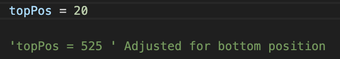
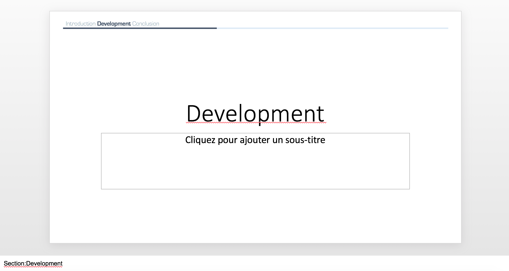
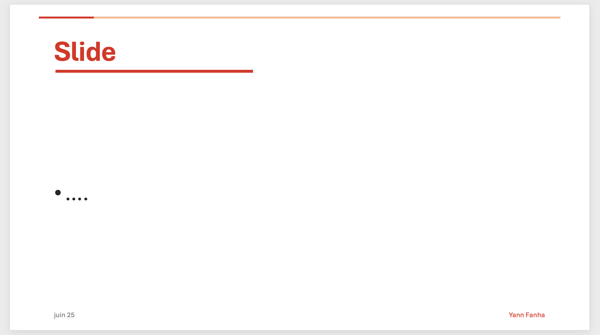
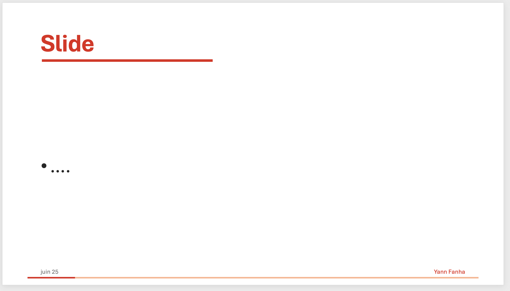

# powerpoint-progressbar
Automation of the creation of a progress bar in powerpoint, and an overview of the sections on each slide

## Description

This vba script will automatically create shapes in your powerpoint
document that indicate the progression on the whole presentation as
a progress bar, and an indication of the section your are currently in.

## How does it work?
The only thing you have to do is to put in the notes of the slides
the names of the sections with the following form "Section:title",
title being the the title of the section for example Introduction.
This information should be on the first line of the slide note, and 
everything that follows will be discarded in the program.

## Parameters
I did not want to have popup windows each time the script is called. 
This is why the parameters are written as constants in the code. To 
modify it, just change their values (colors, font, size, etc.).

## How to use it
You just have to open the script editor, create a new script and copy/paste
the code in it. Then, each time you want to update the progress bar, just
execute it. If a progress bar has already been inserted, it will be 
automatically removed.

### Change position
You can adjust vertical position by editing this value


## Snapshot
### Default


### No-title - Top
```topPos = 525```


### No-title - Bottom
```topPos = 20```



# Source
Forked from [eric-guerin/powerpoint-progressbar](https://github.com/eric-guerin/powerpoint-progressbar)